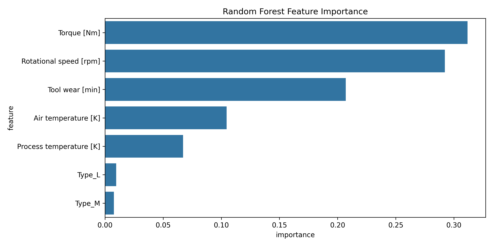
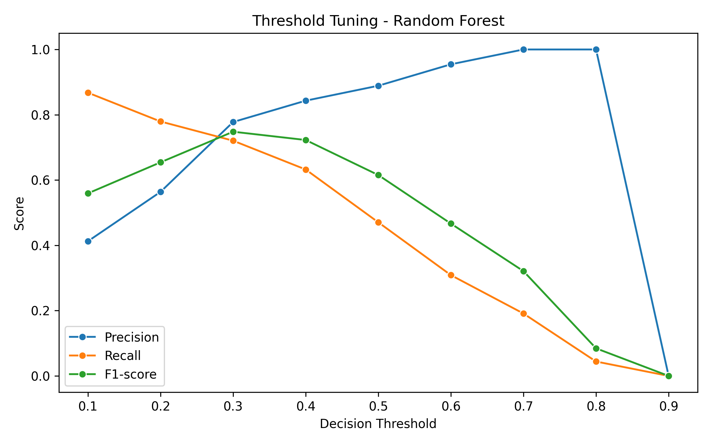

# Predictive Maintenance Machine Learning Project

Machine Learning project for industrial predictive maintenance using the AI4I 2020 Predictive Maintenance Dataset.

This project focuses on predicting machine failures using sensor and operational data from industrial equipment. The workflow includes exploratory data analysis (EDA), preprocessing, baseline modeling, Random Forest optimization, threshold tuning, and model evaluation using industry-relevant metrics for imbalanced classification problems.

---

## Business Problem

Unexpected industrial equipment failures can generate:

- Unplanned downtime
- Production losses
- Increased maintenance costs
- Safety risks

The objective of this project is to develop a machine learning model capable of detecting potential machine failures before they occur using operational sensor data.

---

## Dataset

Dataset used:

- AI4I 2020 Predictive Maintenance Dataset
- Source: UCI Machine Learning Repository

Main features include:

- Air temperature
- Process temperature
- Rotational speed
- Torque
- Tool wear
- Product type

Target variable:

- `Machine failure`

---

## Tech Stack

- Python
- Pandas
- NumPy
- Scikit-learn
- Matplotlib
- Seaborn
- Jupyter Lab

---
## Exploratory Data Analysis (EDA)

Key findings from the analysis:

- The dataset is highly imbalanced (~3.4% machine failures)
- Torque and rotational speed showed strong relationships with machine failure
- Rotational speed and torque presented strong inverse correlation
- Tool wear was strongly associated with failure probability
- Failure subtype columns were excluded to avoid data leakage

---

## Modeling Approach

Models evaluated:

1. Logistic Regression (baseline)
2. Random Forest Classifier

Techniques applied:

- Train/test split with stratification
- Pipeline-based preprocessing
- Standard scaling
- One-hot encoding
- Class balancing
- Threshold tuning for recall/precision optimization

---

## Final Model Performance

Final optimized Random Forest model:

| Metric | Value |
|---|---|
| ROC-AUC | 0.96 |
| Precision | 0.78 |
| Recall | 0.72 |
| F1-Score | 0.75 |

Threshold tuning significantly improved recall while maintaining strong precision performance.

---

## Feature Importance



---

## Threshold Tuning



---

## Project Structure

```bash
predictive-maintenance-ml/
│
├── data/
├── notebooks/
├── reports/
├── src/
├── README.md
└── requirements.txt
```

---

## Future Improvements

Potential future enhancements:

- Hyperparameter optimization
- XGBoost / LightGBM comparison
- SHAP explainability
- FastAPI deployment
- Real-time inference pipeline
- Docker containerization

---
